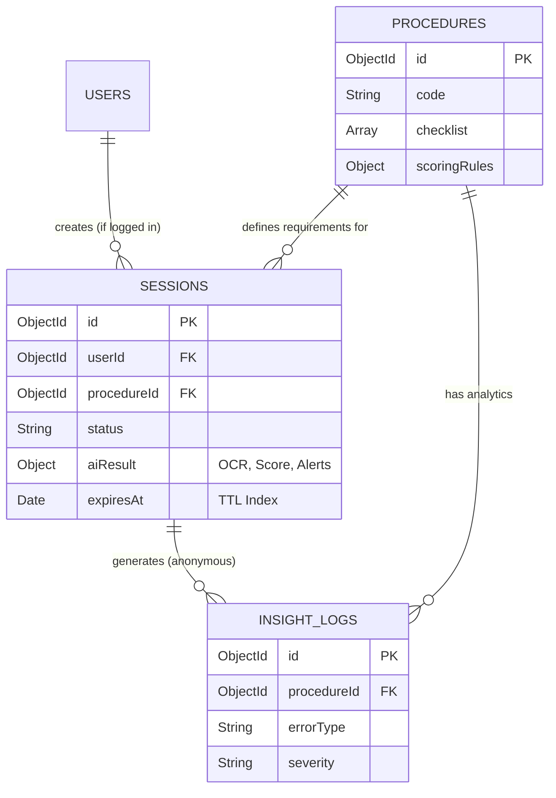

# GovTrust AI — Tài Liệu Thiết Kế Cơ Sở Dữ Liệu (Database Design)
### Vietnamese Student HackAIthon 2026 | Bảng B — Challenger

> **Vai trò:** Database Expert
> **Mục tiêu:** Thiết kế CSDL tối ưu cho kiến trúc Microservices, phục vụ luồng AI xử lý bất đồng bộ, lưu vết phân tích (InsightMap) và đặc biệt tuân thủ khắt khe yêu cầu **Bảo mật dữ liệu công dân (Data Privacy)**.

---

## 1. Tổng quan Kiến trúc Dữ liệu (Polyglot Persistence)

GovTrust AI không dùng 1 CSDL duy nhất mà áp dụng chiến lược **Polyglot Persistence** (chọn DB theo đặc thù dữ liệu) để tối ưu hiệu năng và tách biệt AI với Nghiệp vụ:

1. **MongoDB (Operational DB):** Quản lý bởi NestJS. Lưu trữ tài khoản, phiên làm việc (Session), cấu hình thủ tục (Procedure), và log thống kê (InsightLog). *Lý do chọn:* Schema linh hoạt (JSON-like) rất phù hợp để lưu trữ kết quả OCR và cấu trúc động của Score Breakdown.
2. **ChromaDB (Vector DB):** Quản lý bởi FastAPI. Chuyên lưu trữ Vector Embeddings của các văn bản pháp luật. *Lý do chọn:* Tốc độ truy vấn RAG (Similarity Search) cực nhanh, chạy local bảo mật.
3. **Redis (In-memory/Queue):** Lưu trữ hàng đợi BullMQ (Job queue) và caching session tạm thời.
4. **Local Storage / S3 (Object Storage):** Nơi lưu file ảnh gốc (CCCD, Giấy khai sinh) tải lên, đi kèm cơ chế **tự động xóa (Cronjob/TTL)**.

---

## 2. Thiết kế Lược đồ (Schema Design) — MongoDB

Dưới đây là cấu trúc các Collections trong MongoDB, sử dụng định dạng JSON Schema / TypeScript interface.

### 2.1. Collection: `users` (Tài khoản người dùng)
*Phân quyền RBAC cơ bản. Người dân có thể dùng ẩn danh (Guest) hoặc tạo tài khoản để lưu lịch sử.*

```typescript
{
  _id: ObjectId,
  username: String,       // Số điện thoại hoặc CCCD
  passwordHash: String,   // Bcrypt hash
  fullName: String,
  role: Enum("CITIZEN", "OFFICER", "ADMIN"),
  organization: String,   // Nơi công tác (nếu là OFFICER, vd: "UBND Phường X")
  createdAt: Date,
  updatedAt: Date
}
```

### 2.2. Collection: `procedures` (Định nghĩa Thủ tục hành chính)
*Cấu hình động cho từng thủ tục. Nếu BTC thêm thủ tục mới, chỉ cần thêm 1 document vào đây, không cần sửa code.*

```typescript
{
  _id: ObjectId,
  code: String,                 // Mã thủ tục (vd: "DK_KHAI_SINH")
  name: String,                 // Tên hiển thị
  description: String,
  department: String,           // Cơ quan giải quyết
  
  // Danh sách giấy tờ cần nộp
  checklist: [{
    id: String,                 // "cccd_cha_me"
    name: String,               // "CCCD/CMND của Cha hoặc Mẹ"
    isRequired: Boolean,        
    acceptedTypes: ["CCCD", "CMND", "PASSPORT"],
    points: Number              // Điểm cộng nếu có
  }],

  // Cấu trúc form để SmartForm tự điền
  formFields: [{
    id: String,                 // "hoTenNguoiYeuCau"
    label: String,
    required: Boolean,
    sourceMap: [String]         // Ưu tiên lấy từ: ["cccd.hoTen", "hk.chuHo"]
  }],

  // Trọng số chấm điểm
  scoringRules: {
    baseScore: Number,          // Thường là 100
    penalties: {
      missingRequired: Number,  // -20đ
      infoMismatch: Number,     // -10đ
      expiredDoc: Number,       // -15đ
      lowQualityImage: Number   // -5đ
    }
  },
  isActive: Boolean
}
```

### 2.3. Collection: `sessions` (Phiên tiền kiểm hồ sơ) — BẢNG QUAN TRỌNG NHẤT
*Bảng này lưu toàn bộ vòng đời của 1 lần người dân submit hồ sơ. Sử dụng **TTL Index** để tự hủy sau thời gian quy định.*

```typescript
{
  _id: ObjectId,
  userId: ObjectId,             // Null nếu là Guest
  procedureId: ObjectId,        // Ref -> procedures
  
  // Trạng thái của luồng Event-Driven
  status: Enum(
    "INIT",           // Mới tạo
    "UPLOADING",      // Đang tải file
    "AI_PROCESSING",  // Đang nằm trong Queue/FastAPI
    "SCORED",         // Đã chấm điểm xong
    "CONFIRMED",      // Công dân xác nhận nộp
    "REJECTED"        // Hủy bỏ
  ),

  // File đính kèm (chỉ lưu đường dẫn tạm)
  documents: [{
    docTypeId: String,          // Map với checklist.id
    fileUrl: String,            // Đường dẫn tới Local/S3
    uploadTime: Date
  }],

  // ==========================================
  // PHẦN KẾT QUẢ TỪ AI GATEWAY TRẢ VỀ
  // ==========================================
  aiResult: {
    // Kết quả thô từ VNPT OCR
    ocrData: {
      "cccd_cha_me": {
        provider: "VNPT_EKYC",
        confidence: 0.95,
        fields: { hoTen: "NGUYỄN VĂN A", ngaySinh: "01/01/1990", ... },
        liveness: true
      }
    },
    
    // Kết quả CrossCheck
    crossCheck: {
      mismatches: [{ field: "hoTen", docs: ["cccd", "khai_sinh"], diff: "Sai đệm" }],
      missing: ["giay_chung_sinh"]
    },

    // Kết quả Score Engine
    score: {
      total: Number,            // 72/100
      grade: Enum("A", "B", "C", "D"),
      breakdown: [{
        rule: "missingRequired",
        impact: -20,
        message: "Thiếu giấy chứng sinh"
      }],
      canSubmit: Boolean        // Đạt chuẩn nộp chưa?
    },

    // Kết quả LawGuard
    lawGuardAlerts: [{
      itemId: String,
      message: String,
      source: { title: "Luật Hộ tịch", article: "Điều 16" },
      confidence: Number
    }],

    // Dữ liệu SmartForm đã map
    formData: {
      hoTenNguoiYeuCau: { value: "NGUYỄN VĂN A", source: "cccd", confidence: 0.95 }
    }
  },

  officerNotes: String,         // Cán bộ ghi chú (Gov Re-check)
  
  createdAt: Date,
  updatedAt: Date,
  
  // BẢO MẬT: TTL Index - Tự động xóa sau 24h
  expiresAt: Date               
}
```
*Ghi chú CSDL:* Tạo Index `{"expiresAt": 1}`, `expireAfterSeconds: 0` để MongoDB tự động Hard-delete các phiên làm việc, đảm bảo không rò rỉ dữ liệu cá nhân.

### 2.4. Collection: `insight_logs` (Kho dữ liệu cho InsightMap)
*Chỉ chứa metadata (dữ liệu phi định danh). Được tách ra khỏi `sessions` để lưu trữ lâu dài phục vụ vẽ biểu đồ.*

```typescript
{
  _id: ObjectId,
  procedureId: ObjectId,        // Lỗi xảy ra ở thủ tục nào
  sessionId: ObjectId,          // Dùng để trace (nhưng nội dung session đã bị xóa)
  
  // Thông tin lỗi ẩn danh
  errorType: Enum(
    "MISSING_DOC", "INFO_MISMATCH", "EXPIRED_DOC", 
    "LOW_QUALITY_IMG", "LIVENESS_FAIL"
  ),
  severity: Enum("HIGH", "MEDIUM", "LOW"),
  specificDocType: String,      // Lỗi ở giấy tờ nào (vd: "cccd")
  
  // Thông tin về luồng
  finalScore: Number,
  droppedAtStep: String,        // Dừng lại ở bước nào (Upload, Score, Form)
  processingTimeMs: Number,     // Đo lường độ trễ
  
  deviceType: Enum("MOBILE", "DESKTOP"),
  createdAt: Date
}
// KHÔNG CHỨA: Tên, số CCCD, hình ảnh, địa chỉ.
```

---

## 3. Thiết kế Lược đồ — Vector DB (ChromaDB)

Lưu trữ riêng bên trong AI Gateway (FastAPI) để tối ưu truy xuất nội bộ.

### Collection: `legal_sources`
Lưu trữ các đoạn (chunks) của văn bản pháp luật, nghị định, thông tư.

| Trường | Kiểu dữ liệu | Mô tả |
| --- | --- | --- |
| `id` | String | Unique ID (vd: `luat-ho-tich-2014-chuong2-dieu16-chunk1`) |
| `embedding` | Vector[768] | Vector sinh ra từ model `sentence-transformers` |
| `document` | String | Nội dung text thuần của chunk (khoảng 300-500 từ) |
| `metadata` | JSON | Dữ liệu lọc: `{"category": "HO_TICH", "title": "Luật Hộ tịch 2014", "article": "Điều 16", "url": "..."}` |

**Cách query (RAG):**
1. Nhận query: *"Quy định về giấy chứng sinh khi đăng ký khai sinh"*
2. Chuyển thành Vector.
3. Similarity Search trong `legal_sources` (có thể filter `metadata.category == "HO_TICH"` để thu hẹp phạm vi, tăng tốc độ).

---

## 4. Chính sách Bảo mật Dữ liệu (Data Privacy Policies)

Thiết kế DB này giải quyết triệt để bài toán khó nhất của GovTech: **Trách nhiệm bảo vệ dữ liệu công dân (Data Privacy)**, rất dễ ăn điểm ở tiêu chí "An toàn thông tin".

### 4.1. Cơ chế "Tự hủy" (Zero-Retention)
Hệ thống AI đóng vai trò "Tiền kiểm", không phải là "Kho lưu trữ quốc gia".
- **Trên MongoDB:** Trường `expiresAt` trong bảng `sessions` được set là `now + 24 hours`. TTL Index của MongoDB sẽ tự dọn rác (xóa toàn bộ object) khi hết hạn.
- **Trên Object Storage (Disk/S3):** Ảnh chụp CCCD tải lên được chạy một Cronjob mỗi đêm (hoặc sau khi session kết thúc) để xóa vĩnh viễn. 

### 4.2. Cơ chế "Rút trích Phi định danh" (Anonymization)
Trước khi xóa Session, hệ thống sẽ đẩy các metric (bị lỗi gì, mất bao lâu, thiết bị gì) sang bảng `insight_logs`.
Bảng `insight_logs` tồn tại vĩnh viễn, nhưng **tuyệt đối không có PII** (Personally Identifiable Information - Thông tin định danh). Việc này giúp Cán bộ vẫn có đủ Data để vẽ biểu đồ Heatmap (InsightMap) mà không vi phạm quyền riêng tư.

### 4.3. RBAC (Role-Based Access Control)
- **CITIZEN:** Chỉ đọc được `session` do chính mình tạo ra (dựa trên JWT token/session cookie).
- **OFFICER:** Xem được `sessions` ở trạng thái "CONFIRMED" để tái kiểm, xem được `insight_logs`.
- **AI WORKER:** Chỉ có quyền UPDATE (ghi thêm kết quả) vào bảng `sessions`, không được phép DROP hay DELETE.

---

## 5. ERD Khái quát (Entity-Relationship)


*(Ghi chú: Bảng SESSIONS chứa object `aiResult` rất phức tạp. Nhờ dùng MongoDB (NoSQL), ta không cần tạo thêm 4-5 bảng con rườm rà như SQL truyền thống, giúp truy vấn cực nhanh trong 1 lần đọc).*
