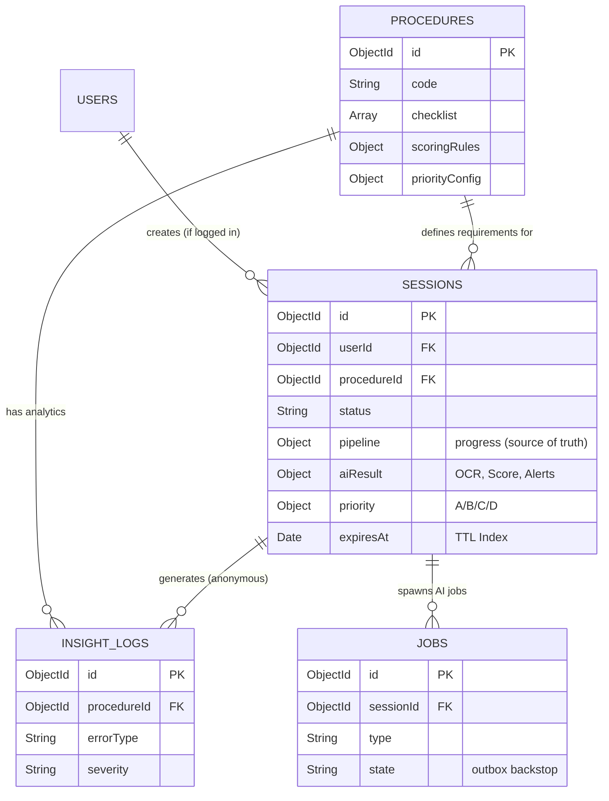

# GovTrust AI — Tài Liệu Thiết Kế Cơ Sở Dữ Liệu (Database Design)
### Vietnamese Student HackAIthon 2026 | Bảng B — Challenger

> **Vai trò:** Database Expert
> **Phiên bản:** 2.0 (bản chốt) — 29/06/2026
> **Mục tiêu:** Thiết kế CSDL cho kiến trúc Microservices, xử lý AI bất đồng bộ, lưu vết phân tích (InsightMap), tuân thủ khắt khe **Bảo mật dữ liệu công dân (Data Privacy)**.

> **Triết lý cốt lõi — MongoDB là nguồn sự thật (Source of Truth):**
> - **MongoDB** luôn được tin cậy tuyệt đối. Mọi dữ liệu nghiệp vụ "chính thức" chỉ tồn tại khi đã ghi vào MongoDB.
> - **Qdrant** và **Redis** chỉ là lớp phái sinh/tăng tốc — **rebuild được** và **fallback xuống MongoDB** khi mất.

---

## 1. Tổng quan Kiến trúc Dữ liệu (Polyglot Persistence)

GovTrust AI áp dụng **Polyglot Persistence** (chọn DB theo đặc thù dữ liệu) để tách AI khỏi Nghiệp vụ và tối ưu hiệu năng:

| Store | Chủ sở hữu | Vai trò | Mất thì sao? |
|---|---|---|---|
| **MongoDB** `govtrust_business` | NestJS | **Nguồn sự thật**: users, procedures, sessions (+aiResult), jobs, insight_logs | Hệ thống dừng — đây là chân lý |
| **Qdrant** `legal_chunks` | FastAPI | Chỉ mục ngữ nghĩa văn bản pháp luật (vector + payload) | Rebuild từ nguồn luật; LawGuard tạm degrade |
| **Redis** | Shared qua API | Tăng tốc + vận chuyển job (BullMQ queue, cache, pipeline status) | **Fallback xuống MongoDB**, chạy degraded |
| **Object Storage** (Local/S3) | NestJS | File ảnh gốc (CCCD, giấy khai sinh) — **tạm**, auto-delete | Ảnh mất sau phiên (đúng thiết kế zero-retention) |

**Nguyên tắc Database per Service:** NestJS **không** truy cập Qdrant; FastAPI **không** truy cập MongoDB. Trao đổi qua REST nội bộ + Redis Queue theo `sessionId`.

```
Upload ảnh → Object Storage (tạm)
                │ fileUrl
                ▼
NestJS ghi session (MongoDB, status=AI_PROCESSING)
   │  insert job (jobs, state=PENDING)  ← chân lý của hàng đợi
   │  enqueue BullMQ (Redis)            → state=ENQUEUED
   ▼
FastAPI worker: OCR → CrossCheck → LawGuard(query Qdrant) → Score
   │ trả kết quả đã chuẩn hóa (REST/job result)
   ▼
NestJS GHI aiResult vào session (MongoDB)  ◄── chỉ lúc này mới "chính thức"
   │ trước khi session bị TTL xóa
   ▼
rút metadata ẩn danh → insight_logs (MongoDB, vĩnh viễn, KHÔNG PII)
```

---

## 2. Thiết kế Lược đồ (Schema Design) — MongoDB

DB `govtrust_business`. 5 collections: `users`, `procedures`, `sessions`, `jobs`, `insight_logs`.

### 2.1. Collection: `users` (Tài khoản người dùng)
*Phân quyền RBAC. Người dân có thể dùng ẩn danh (Guest) hoặc tạo tài khoản để lưu lịch sử.*

```typescript
{
  _id: ObjectId,
  username: String,       // Số điện thoại hoặc CCCD
  passwordHash: String,   // Bcrypt hash
  fullName: String,
  role: Enum("CITIZEN", "OFFICER", "ADMIN"),
  organization: String,   // Nơi công tác (nếu OFFICER, vd: "UBND Phường X")
  createdAt: Date,
  updatedAt: Date
}
```
**Index:** `{ username: 1 }` unique.

### 2.2. Collection: `procedures` (Định nghĩa Thủ tục hành chính)
*Cấu hình động. Thêm thủ tục mới = thêm 1 document, không sửa code.*

```typescript
{
  _id: ObjectId,
  code: String,                 // "DK_KHAI_SINH"
  name: String,
  description: String,
  department: String,

  checklist: [{
    id: String,                 // "cccd_cha_me"
    name: String,               // "CCCD/CMND của Cha hoặc Mẹ"
    isRequired: Boolean,
    acceptedTypes: ["CCCD", "CMND", "PASSPORT"],
    points: Number
  }],

  formFields: [{
    id: String,                 // "hoTenNguoiYeuCau"
    label: String,
    required: Boolean,
    sourceMap: [String]         // ["cccd.hoTen", "hk.chuHo"]
  }],

  // Trọng số chấm điểm — CHỐT giá trị mặc định
  scoringRules: {
    baseScore: Number,          // 100
    penalties: {
      missingRequired: Number,  // -20
      infoMismatch: Number,     // -10
      expiredDoc: Number,       // -15
      lowQualityImage: Number   // -5
    }
  },

  // Cấu hình ưu tiên xử lý (Priority Ranking - bước 10)
  priorityConfig: {
    baseUrgency: Enum("HIGH", "MEDIUM", "LOW"),
    slaDays: Number             // Hạn xử lý mặc định (ngày)
  },

  isActive: Boolean
}
```
**Index:** `{ code: 1 }` unique, `{ isActive: 1 }`.

### 2.3. Collection: `sessions` (Phiên tiền kiểm hồ sơ) — BẢNG QUAN TRỌNG NHẤT
*Toàn bộ vòng đời 1 lần kiểm hồ sơ. Embed `aiResult` (idiomatic MongoDB — 1 lần đọc lấy đủ). **TTL Index** tự hủy.*

```typescript
{
  _id: ObjectId,
  userId: ObjectId,             // Null nếu Guest
  procedureId: ObjectId,        // Ref -> procedures

  status: Enum(
    "INIT", "UPLOADING", "AI_PROCESSING",
    "SCORED", "CONFIRMED", "RECHECKED", "REJECTED"
  ),

  // Theo dõi tiến độ pipeline — NGUỒN SỰ THẬT cho progress bar
  // (Redis chỉ cache lại; mất Redis thì đọc thẳng từ đây)
  pipeline: {
    step: String,               // "LAWGUARD"
    steps: {                    // trạng thái từng bước
      ocr: String, crosscheck: String, score: String,
      lawguard: String, smartform: String
    },                          // mỗi giá trị: "queued|processing|done|failed"
    updatedAt: Date
  },

  // File đính kèm — CHỈ lưu con trỏ, KHÔNG lưu ảnh trong DB
  documents: [{
    docTypeId: String,          // Map với checklist.id
    fileUrl: String,            // Đường dẫn Object Storage tạm
    uploadTime: Date
  }],

  // ====== KẾT QUẢ TỪ AI GATEWAY (embed) ======
  aiResult: {
    ocrData: {
      "cccd_cha_me": {
        provider: "VNPT_EKYC",
        confidence: 0.95,
        fields: { hoTen: "NGUYỄN VĂN A", ngaySinh: "01/01/1990" /* ... */ },
        liveness: true
      }
    },
    crossCheck: {
      mismatches: [{ field: "hoTen", docs: ["cccd", "khai_sinh"], diff: "Sai đệm" }],
      missing: ["giay_chung_sinh"],
      expired: []
    },
    score: {
      total: Number,            // 72
      grade: Enum("A", "B", "C", "D"),
      breakdown: [{ rule: "missingRequired", impact: -20, message: "Thiếu giấy chứng sinh" }],
      canSubmit: Boolean
    },
    lawGuardAlerts: [{
      itemId: String,
      message: String,
      source: { title: "Luật Hộ tịch", article: "Điều 16" },
      confidence: Number,
      needsVerification: Boolean
    }],
    formData: {
      hoTenNguoiYeuCau: { value: "NGUYỄN VĂN A", source: "cccd", confidence: 0.95, editable: true }
    }
  },

  // Gov Re-Check (bước 9) + Priority (bước 10)
  priority: {
    level: Enum("A", "B", "C", "D"),
    reason: String,             // "Hồ sơ khai sinh - hạn xử lý còn 2 ngày"
    finalDecisionByOfficer: String
  },
  officerNotes: String,

  createdAt: Date,
  updatedAt: Date,

  // BẢO MẬT: TTL Index — tự động xóa
  expiresAt: Date               // = now + SESSION_TTL_HOURS (mặc định 24h)
}
```
**Index:**
- `{ expiresAt: 1 }` với `expireAfterSeconds: 0` → MongoDB hard-delete khi hết hạn.
- `{ status: 1 }` (lọc hồ sơ CONFIRMED cho officer), `{ userId: 1 }`, `{ procedureId: 1 }`.

> **Chốt:** tên field TTL thống nhất là **`expiresAt`** (bỏ `expiredAt`). TTL mặc định **24h**, cấu hình qua env `SESSION_TTL_HOURS` (public demo có thể hạ xuống 0.5 = 30 phút).

### 2.4. Collection: `jobs` (Outbox — backstop bền vững cho hàng đợi AI)
*Đảm bảo KHÔNG mất job khi Redis chết. State của job là nguồn sự thật ở MongoDB; BullMQ chỉ là phương tiện vận chuyển.*

```typescript
{
  _id: ObjectId,
  sessionId: ObjectId,
  type: Enum("OCR", "CROSSCHECK", "LAWGUARD", "SCORE", "SMARTFORM"),
  state: Enum("PENDING", "ENQUEUED", "PROCESSING", "DONE", "FAILED"),
  attempts: Number,             // số lần thử
  payload: Object,              // dữ liệu tối thiểu để xử lý
  lastError: String,
  createdAt: Date,
  updatedAt: Date,
  // TTL nhẹ cho job DONE để dọn rác (vd 24h)
  expiresAt: Date
}
```
**Index:** `{ state: 1, updatedAt: 1 }` (cho reconciler quét PENDING/PROCESSING quá hạn), `{ sessionId: 1 }`, `{ expiresAt: 1 }` TTL.

**Vòng đời (Outbox pattern):**
1. NestJS `insert(job, state=PENDING)` vào MongoDB — **chân lý**.
2. NestJS enqueue BullMQ (Redis) → `update(state=ENQUEUED)`.
3. FastAPI worker nhận → `PROCESSING` → ghi `aiResult` vào `sessions` → `DONE`.

### 2.5. Collection: `insight_logs` (Kho dữ liệu cho InsightMap)
*Chỉ metadata phi định danh. Tách khỏi `sessions` để lưu lâu dài. **Collection duy nhất sống vĩnh viễn cùng users/procedures.***

```typescript
{
  _id: ObjectId,
  procedureId: ObjectId,
  sessionId: ObjectId,          // trace (nội dung session đã bị xóa)
  errorType: Enum("MISSING_DOC", "INFO_MISMATCH", "EXPIRED_DOC",
                  "LOW_QUALITY_IMG", "LIVENESS_FAIL"),
  severity: Enum("HIGH", "MEDIUM", "LOW"),
  specificDocType: String,      // "cccd"
  finalScore: Number,
  droppedAtStep: String,        // "Upload" | "Score" | "Form"
  processingTimeMs: Number,
  deviceType: Enum("MOBILE", "DESKTOP"),
  createdAt: Date
}
// KHÔNG CHỨA: Tên, số CCCD, hình ảnh, địa chỉ.
```
**Index:** `{ procedureId: 1, errorType: 1 }`, `{ createdAt: 1 }`.

---

## 3. Thiết kế Lược đồ — Vector DB (Qdrant)

> **CHỐT:** dùng **Qdrant** (không phải ChromaDB). Đây là chỉ mục phái sinh — **rebuild được** từ nguồn luật, không phải nguồn sự thật.

### Collection: `legal_chunks`
| Tham số | Giá trị |
|---|---|
| Vector size | **768** (model `sentence-transformers`) |
| Distance | **Cosine** |
| Payload index | `category` (keyword) — filter nhanh theo nhóm thủ tục |

**Cấu trúc mỗi point:**
```python
{
  "id": "luat-ho-tich-2014-dieu16-chunk1",
  "vector": [ /* 768 floats */ ],
  "payload": {
    "chunkId": "luat-ho-tich-2014-dieu16-chunk1",
    "category": "HO_TICH",            # dùng để filter
    "title": "Luật Hộ tịch 2014",
    "article": "Điều 16",
    "url": "https://...",
    "sourceVersion": "2014",          # versioning căn cứ pháp lý
    "text": "<nội dung chunk 300-500 từ>"
  }
}
```

**Cách query (RAG):**
1. Nhận query: *"Quy định về giấy chứng sinh khi đăng ký khai sinh"*.
2. Embedding → vector.
3. `qdrant.search(collection="legal_chunks", query_vector, filter={"category":"HO_TICH"}, limit=top_k)`.

**Bảo mật:** người dùng **không bao giờ ghi** vào Qdrant (chống RAG injection). Chỉ pipeline ingest (do nhóm kiểm soát) mới upsert.

---

## 4. Chiến lược Độ bền & Fallback (Resilience)

> Mục tiêu: **mất Redis hệ thống vẫn đúng, chỉ chậm hơn** — luôn rơi xuống MongoDB.

### 4.1. Redis giữ gì & fallback ra sao
| Redis giữ | Bản gốc ở MongoDB | Khi Redis DOWN |
|---|---|---|
| BullMQ job queue | `jobs` collection | Reconciler đọc `jobs` state=PENDING, xử lý/re-enqueue |
| Pipeline status (progress bar) | `sessions.pipeline` | Frontend poll thẳng `GET /sessions/:id` |
| Cache Top-k LawGuard | (tính lại được) | Query lại Qdrant |
| Cache template/form | `procedures` | Đọc thẳng MongoDB |

### 4.2. Redis key & TTL
| Mục đích | Key pattern | TTL |
|---|---|---|
| Job queue | `bull:ai-pipeline:*` | theo job |
| Pipeline status cache | `session:{id}:status` | 1h |
| Cache Top-k LawGuard | `lawguard:{procedureId}:{queryHash}` | 6–24h |
| Cache template thủ tục | `procedure:{code}` | 24h |

### 4.3. Cache fail-open (bọc mọi lệnh Redis)
Mọi truy cập Redis bọc try/catch — lỗi thì trả miss/no-op, **không ném lỗi lên nghiệp vụ**:
```typescript
async get(key) {
  try { return await redis.get(key); }
  catch (e) { logger.warn('Redis down → fallback Mongo'); return null; }
}
```

### 4.4. Reconciler (cron 30–60s) — chống mất job
```
Quét jobs: state=PENDING quá X giây (chưa enqueue được vì Redis lỗi)
        OR state=PROCESSING quá Y phút (worker chết)
→ Redis sống lại: re-enqueue BullMQ
→ Redis vẫn down: xử lý đồng bộ trực tiếp (degraded mode)
```
Vì state nằm ở MongoDB nên **không job nào biến mất**.

### 4.5. Hai chế độ vận hành
```
        NORMAL                          REDIS DOWN (degraded)
┌──────────────────────┐      ┌──────────────────────────┐
│ status: Redis cache  │      │ status: đọc Mongo trực tiếp│
│ queue:  BullMQ        │      │ queue:  jobs(Mongo)+cron   │
│ cache:  Redis hit     │      │ cache:  query Qdrant lại   │
└──────────────────────┘      └──────────────────────────┘
   nhanh, đầy đủ                  chậm hơn, VẪN ĐÚNG
```

---

## 5. Chính sách Bảo mật Dữ liệu (Data Privacy Policies)

### 5.1. Cơ chế "Tự hủy" (Zero-Retention)
- **MongoDB:** `sessions.expiresAt = now + 24h`; TTL Index hard-delete khi hết hạn.
- **Object Storage:** ảnh CCCD chạy Cronjob xóa mỗi đêm / sau khi session kết thúc.
- **Redis:** mọi key đều có TTL, không giữ PII dài hạn.

### 5.2. Cơ chế "Rút trích Phi định danh" (Anonymization)
Trước khi xóa session, hệ thống đẩy metric (lỗi gì, bao lâu, thiết bị gì) sang `insight_logs` qua hàm `buildInsightLog()` — **whitelist trường + hash 1 chiều `sessionId`**. Strip PII là code, không chỉ comment. `insight_logs` tồn tại vĩnh viễn nhưng **tuyệt đối không có PII**.

### 5.3. RBAC (Role-Based Access Control)
- **CITIZEN:** chỉ đọc `session` do mình tạo (JWT/session cookie).
- **OFFICER:** xem `sessions` trạng thái CONFIRMED để tái kiểm; xem `insight_logs`.
- **ADMIN:** quản lý `procedures`, `users`, cấu hình.
- **AI WORKER:** chỉ UPDATE kết quả vào `sessions`/`jobs`; không DROP/DELETE.

---

## 6. ERD Khái quát (Entity-Relationship)


*(MongoDB (NoSQL) cho phép embed `aiResult` phức tạp trong `sessions` — không cần tách 4-5 bảng con như SQL, truy vấn nhanh trong 1 lần đọc. `jobs` tách riêng vì có vòng đời + truy vấn (reconciler) khác hẳn session.)*

---

## 7. Vận hành / Chạy thử

```bash
# 1. Khởi động data layer (MongoDB + Qdrant + Redis)
docker compose -f infra/docker-compose.yml up -d

# 2. Seed thủ tục MVP + tạo index (idempotent)
cd apps/api && ts-node src/database/seeds/seed.ts

# 3. Tạo collection Qdrant + payload index + ingest văn bản luật
cd apps/ai-gateway && python -m app.vector_db.qdrant_setup
```

Schema NestJS: `apps/api/src/database/schemas/`. Biến môi trường: xem `.env.example` (`SESSION_TTL_HOURS`, `MONGO_URI`, `QDRANT_URL`, `REDIS_URL`).

---

## 8. Quyết định thiết kế đã chốt (đóng Open Issues của SRS)
| # | Quyết định |
|---|---|
| OI-1 | **Qdrant**, collection `legal_chunks`, vector 768, distance Cosine |
| OI-2 | Field TTL **`expiresAt`**, mặc định **24h** (env `SESSION_TTL_HOURS`) |
| OI-3 | **Embed `aiResult`** trong `sessions` (không tách collection con) |
| OI-4 | Penalties mặc định trong `procedures.scoringRules`: -20/-10/-15/-5 |
| OI-5 | (Chính sách mock OCR — ngoài phạm vi DB, xem SRS) |
| + | **MongoDB là Source of Truth**; thêm `jobs` (outbox) + reconciler để Redis fallback xuống Mongo |
